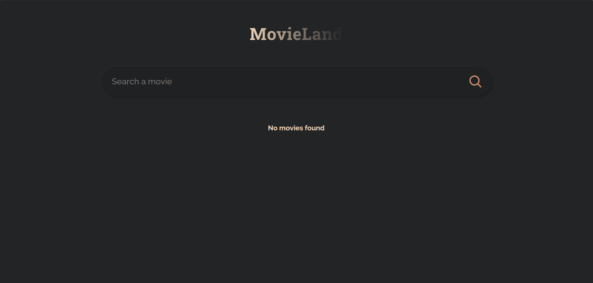

<div id="top"></div>


</br>


<div align="center">
  <h1 align="center">MovieLand 🎥</h1>
  <p>
    <b>MovieLand</b> is a React-based movie search app that allows users to explore movies by fetching data from the OMDb API. 
    Users can search for movies by title and view key details such as the movie's title, release year, type, and poster.
  </p>
</div>




### Features

- Search Movies: Enter a movie title to fetch and display a list of matching movies.
- Dynamic Results: Displays movie posters, titles, release years, and types.
- Responsive Design: Clean and simple user interface.


---

### Technologies Used

- **React** (Hooks: useState, useEffect)
- **CSS** for styling
- Fetch API for data retrieval
- **OMDb API** for movie information

---

### Setup

<ol>
  <li>Clone the repository</li>
  <li>Install dependencies with ```npm install</li>
  <li>Replace the ```API_URL``` with your own OMDb API key in the code:</li>
  ```const API_URL = "http://www.omdbapi.com/?apikey=YOUR_API_KEY&";
  <li>Start the app with ```npm start</li>
</ol>


